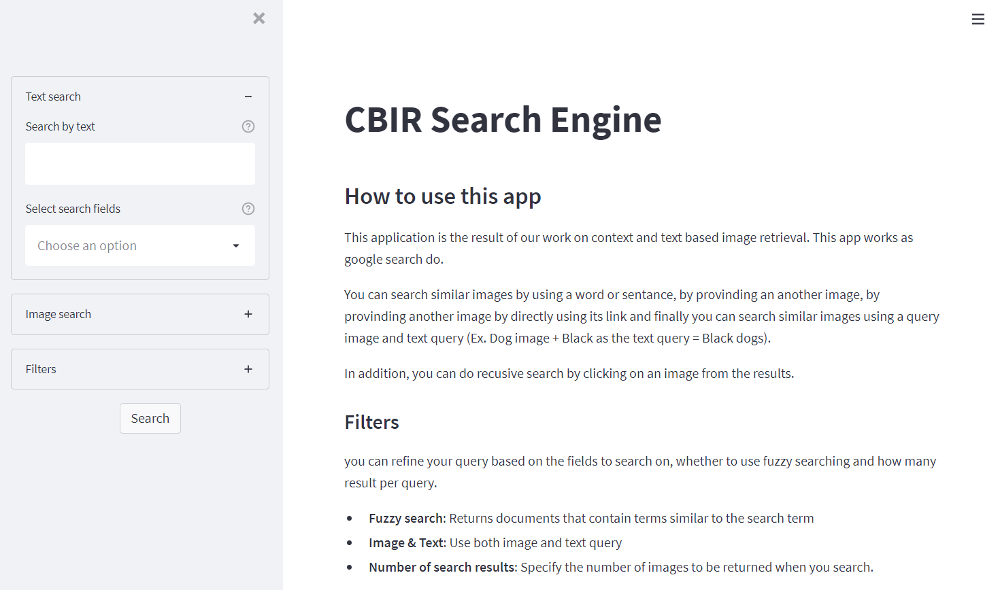
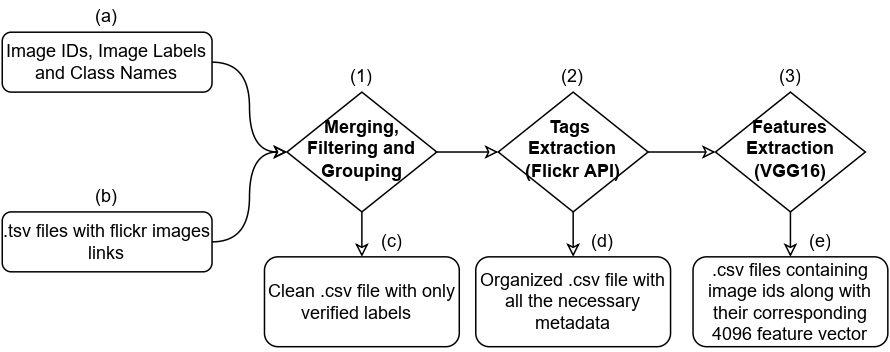

# Content and Text Based Image Retrieval Search Engine
## About the project
An image search engine that covers over 2 million annotated images from [Open Images Dataset](https://storage.googleapis.com/openimages/web/index.html). This search engine enables its users to search using text, images or a combination of both.

## Getting started
### Prerequisites
Your machine should have installed:
- Docker
- ElasticSearch 7.14.1
- Elastiknn plugin 7.14.1.0  
  `elasticsearch-plugin install https://github.com/alexklibisz/elastiknn/releases/tag/7.14.1.0 ` 

### Installation
In order to reproduce the project you have to:

1. Clone the repository.
2. Move to the project directory.
3. Get the data index. This can be done in two methods:
    1. Create a new index
        1. Execute [download_data.sh](data/download_data.sh) to get the data.
        2. Follow the indexing steps in [indexing.ipynb](data-preparation/indexing.ipynb).
    2. Restore our index.
        1. Download the index. https://drive.google.com/file/d/1HVr_i4XYx5uQ67B94pxX83g7ZD1kxOcf/view?usp=sharing.
        2. Go to ElasticSearch/config directory.
        3. open elasticsearch.yml and add the following line:   `path.repo:[path_to_index/elasticsearch-backup]`
        4. Reload indexing using `PUT` request to   `http://localhost:9200/_snapshot/open-images` and the following header  
        `{
            "type": "fs",
            "settings":{
                "location": "path_to_index/elasticsearch-backup",
                "compress": true
                }
        }`
        5. Restore the index using `POST` request to  
        `http://localhost:9200/_snapshot/open-images/snapshot_02_12_2021/_restore`

5. Run `docker-compose up --build`
Once these steps are done, the web application should start in the browser.

## Project process
This project is brought down into 4 steps:
### Data processing

### Data indexing
Data indexing is performed using ElasticSearch python client. This operation is split into two tasks:
1. Indexing text data.
2. Indexing image feature vectors using Elastiknn plugin which enables storing numerical vectors and provides the Approximate Nearest Neighbours queries in ES.
### Application development
The web application is developed using:
- ElasticSearch python client: to query elasticsearch index.
- FastAPI : to develop an API to enable querying from the web application.
- Streamlit : to design a frontend for the application where users perform text and image search.

### Deployment
Both of the API and frontend of the web application are containerized using Docker and docker-compose.

More about this process is available in this detailed [report](/docs).

## Contribution

